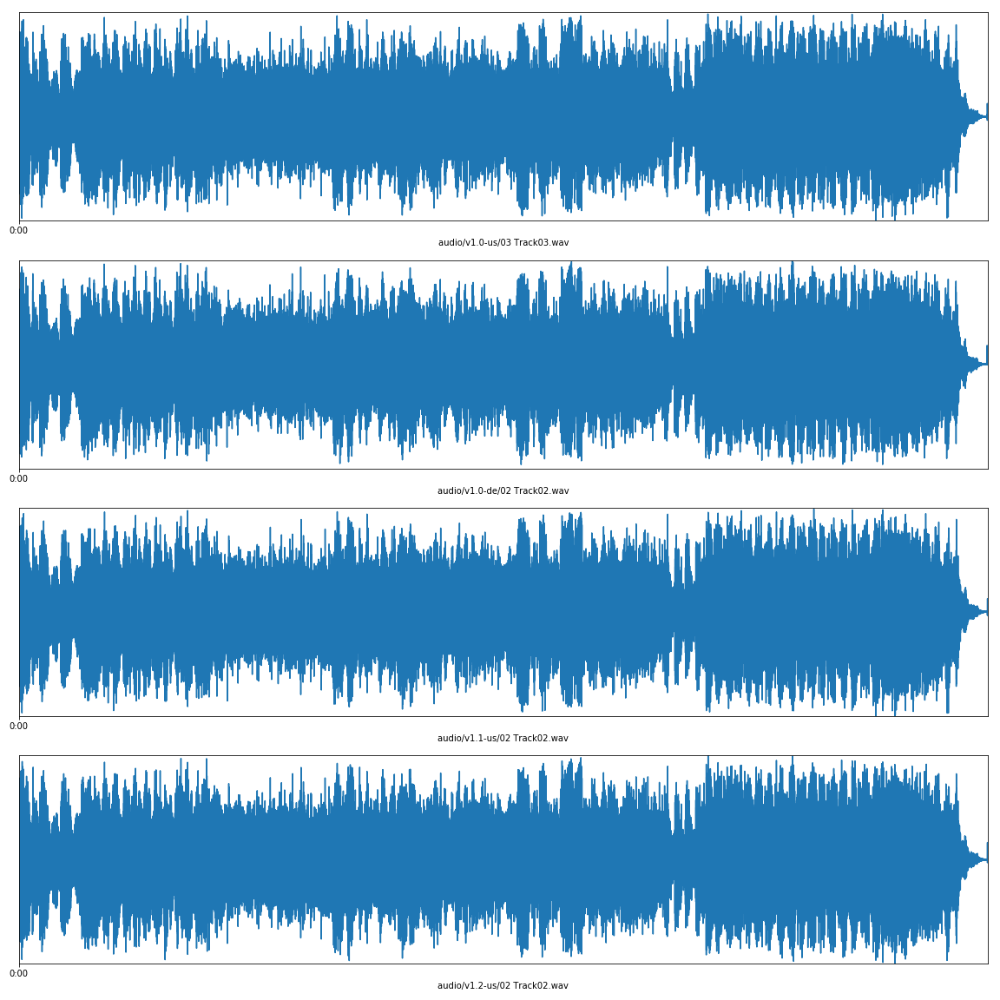

# Ambient tracks

Ambient tracks are music tracks, longer than sound effects. There are two 3 minute tracks for the base version of MechWarrior 3, and one 9.5 minute track for the Pirate's Moon expansion. They are never installed, and so must be retrieved from the CD. They are used as background music during missions.

## Investigation

When I insert a MechWarrior 3 CD into a Mac, iTunes opens. When I insert a MechWarrior 3 CD into a Windows PC, this message shows:


An [enhanced audio CD](https://en.wikipedia.org/wiki/Enhanced_CD) contains data and audio on the same disk. So the ambient tracks are simply CD audio, which are presumably streamed from the CD during gameplay. A re-implementation should also be able to do this.

There are only two ambient/background tracks, roughly three minutes earch. Using a tool such as [ExactAudioCopy](http://www.exactaudiocopy.de/) (EAC)[^cd-audio-tools], it is possible to copy the audio tracks as Waveform Audio files (WAV, `*.wav`) where it is legal to do so.

For individuals wanting to enjoy these tracks, it's worth noting these WAV files are rather large. For preservation, a lossless compression like [FLAC](https://xiph.org/flac/) uses about ~40% of the storage space. Since the tracks slightly differ between the different versions, for general use a lossy format like [AAC](https://en.wikipedia.org/wiki/Advanced_Audio_Coding) with a bitrate of 128 kilobytes or above should be plenty. This produces file sizes around 10% of the original.

[^cd-audio-tools]: EAC is Windows only. Options on macOS are [RIP](https://sbooth.org/Rip/), [Max](https://sbooth.org/Max/), [XLD](https://tmkk.undo.jp/xld/index_e.html), or iTunes. There are *many* options on Linux, I suggest [Morituri](https://github.com/thomasvs/morituri).

## In-game use

To my knowledge, the ambient tracks do not play in the menus, only during gameplay. I don't know how the engine uses these tracks:

1. Does the engine select a random track, or always starts on the first (audio) track?
2. Does the engine loop the tracks once they finish playing, or is there simply slience after a mission time of over six minutes?

## Appendix 1: Detailed version comparison

Between the versions, all the tracks had different [CRC](https://en.wikipedia.org/wiki/Cyclic_redundancy_check) codes. Another oddity is the fact the tracks aren't in the same order on different versions. I'm unsure why this is. The difference in the audio data could be the result of the manufacturing process. For the German version, it could be due to the SafeDisc DRM (is 2 seconds longer). But they all sound indistinguishable for me, and the waveforms look the same, so it's probably fine.



These are the detailed track information of all MechWarrior 3 versions I own:

**v1.0 US**

| Track |   Start  |  Length  | Start sector | End sector |     Size   |    CRC   |
|-------|---------:|---------:|-------------:|-----------:|-----------:|----------|
|    1  |  0:00.00 | 59:12.45 |         0    |   266444   | 597.64 MiB |          |
|    2  | 59:12.45 |  3:11.69 |    266445    |   280838   |  32.28 MiB | 515BECAE |
|    3  | 62:24.39 |  3:06.06 |    280839    |   294794   |  31.30 MiB | 45D64143 |

CTDB TOCID: `hUJiDDh7s2IYPP1GpLfGVYpIWxE-`

**v1.0 DE**

| Track |   Start  |  Length  | Start sector | End sector |     Size   |    CRC   |
|-------|---------:|---------:|-------------:|-----------:|-----------:|----------|
|    1  |  0:00.00 | 62:48.56 |         0    |   282655   | 634.00 MiB |          |
|    2  | 62:48.56 |  3:06.06 |    282656    |   296611   |  31.30 MiB | EDCC302C |
|    3  | 65:54.62 |  3:13.69 |    296612    |   311155   |  32.62 MiB | A262C28B |

CTDB TOCID: `vPmoaaMWAdaLNkVSMLqK2HZxmaE-`

**v1.1 US**

| Track |   Start  |  Length  | Start sector | End sector |     Size   |    CRC   |
|-------|---------:|---------:|-------------:|-----------:|-----------:|----------|
|    1  |  0:00.00 | 59:12.20 |         0    |   266419   | 597.59 MiB |          |
|    2  | 59:12.20 |  3:06.06 |    266420    |   280375   |  31.30 MiB | 825686B5 |
|    3  | 62:18.26 |  3:11.69 |    280376    |   294769   |  32.28 MiB | 21627377 |

CTDB TOCID: `WJdZLalC42N4VOtU.QQx5GDfvqI-`

**v1.2 US**

| Track |   Start  |  Length  | Start sector | End sector |     Size   |    CRC   |
|-------|---------:|---------:|-------------:|-----------:|-----------:|----------|
|    1  |  0:00.00 | 59:12.34 |         0    |   266433   | 597.62 MiB |          |
|    2  | 59:12.34 |  3:06.06 |    266434    |   280389   |  31.30 MiB | DB5F6872 |
|    3  | 62:18.40 |  3:11.69 |    280390    |   294783   |  32.28 MiB | 61502511 |

CTDB TOCID: `WJdZLalC42N4VOtU.QQx5GDfvqI-`

**v1.2 PM**

| Track |   Start  |  Length  | Start sector | End sector |     Size   |    CRC   |
|-------|---------:|---------:|-------------:|-----------:|-----------:|----------|
|    1  |  0:00.00 | 22:18.11 |         0    |   100360   |            |          |
|    2  | 22:18.11 |  9:22.61 |    100361    |   142571   |            | 535BD032 |

CTDB TOCID: `Y1qrr8eDEKTsSDhgyfHah6MGKzA-`

## Appendix 2: How the waveform plots were made

I used [SciPy](https://www.scipy.org/) to [read WAV file data](https://docs.scipy.org/doc/scipy/reference/generated/scipy.io.wavfile.read.html), and [matplotlib](https://matplotlib.org/) to plot them:


```python
import numpy as np
from scipy.io import wavfile
from scipy.signal import resample

import matplotlib
import matplotlib.pyplot as plt
import matplotlib.ticker as ticker


def time_ticker_format(x, pos=None):
    mins, secs = divmod(x, 60)
    return "{:.0f}:{:02.0f}".format(abs(mins), secs)


def plot_waveforms(tracks, save_name=None, resample_factor=40):
    """This function makes assumptions about the input data: stereo 44100 Hz 16-bit signed PCM"""
    data = []
    rates = []
    for track in tracks:
        rate, stereo = wavfile.read(track, mmap=True)
        samples, channels = stereo.shape
        assert channels == 2, "expecting stereo"
        mono = stereo.mean(1)
        # this is to make the data more resonable to plot
        resampled = resample(mono, int(np.ceil(mono.size / resample_factor)))
        data.append(resampled)
        rates.append(rate)

    rate = rates[0]
    assert all(rate == r for r in rates)

    count = len(tracks)
    fig, axis = plt.subplots(count, 1, figsize=(16, 4 * count))

    for ax, mono, name in zip(axis, data, tracks):
        samples = mono.size
        length = samples / rate
        time = np.linspace(0, length, num=samples)

        ax.plot(time, mono)
        ax.set_xlim(0, length)
        ax.xaxis.set_major_formatter(ticker.FuncFormatter(time_ticker_format))
        ax.xaxis.set_major_locator(ticker.MultipleLocator(20))
        ax.set_ylim(-(1 << 15), (1 << 15))  # signed 16-bit
        ax.yaxis.set_major_locator(ticker.NullLocator())
        ax.xaxis.set_label_text(name)

    fig.tight_layout()
    if save_name:
        plt.savefig(save_name)
        plt.close(fig)
```
